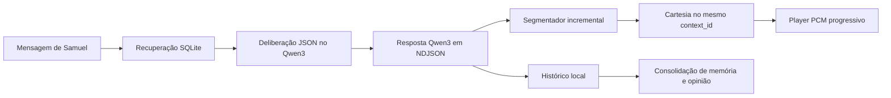

# Lumia Cognitive Core v0.2

Lumia v0.2 evolui o Voice Lab para uma conversa pessoal por voz: o texto digitado é interpretado por um `qwen3:8b` local, passa por uma deliberação estruturada, vira fala inédita em streaming e é persistido com memórias, opiniões e assuntos pendentes. A Cartesia continua sendo usada somente para sintetizar a voz; o cérebro e os dados permanecem locais.

Não existem respostas, saudações ou reações prontas no caminho de produção. A interface principal mostra apenas as mensagens de Samuel e marcadores das falas da Lumia; a transcrição fica no banco e no modo de desenvolvimento recolhível.

## Arquitetura

```text
React/Vite
  ├─ mensagens digitadas + player PCM progressivo
  └─ WebSocket local tipado (JSON + frames PCM com turnId)
       ↓
Node/Express — TurnOrchestrator
  ├─ SQLite: histórico, memória, opiniões e open loops
  ├─ Ollama /api/chat: deliberação JSON + resposta NDJSON
  ├─ SpeechSegmenter: frases naturais sem alterar o texto
  ├─ Cartesia WebSocket: um context_id por turno + continuations
  └─ consolidação estruturada assíncrona
```



As fases de cada turno são contexto, deliberação, resposta pública, voz simultânea e consolidação. Um único `AbortController` cancela Ollama, segmentação e Cartesia; o navegador descarta qualquer frame cujo `turnId` não seja o turno atual.

## Requisitos

- Windows 11.
- Node.js 24.x e npm 11.x recomendados.
- Ollama instalado nativamente.
- Modelo obrigatório `qwen3:8b`.
- Conta Cartesia com acesso ao `sonic-3.5` e ao Voice ID configurado.
- Hardware-alvo: Ryzen 5 5600X, Radeon RX 6650 XT 8 GB, 16 GB RAM. CPU continua sendo um fallback funcional.

## Instalação do Ollama

Instale o Ollama pelo instalador oficial, abra o serviço e baixe explicitamente o modelo:

```powershell
ollama pull qwen3:8b
```

Confirme o serviço e o modelo:

```powershell
Invoke-RestMethod http://127.0.0.1:11434/api/tags
ollama run qwen3:8b "Responda apenas: modelo ativo"
```

O aplicativo não baixa automaticamente vários gigabytes. Se o modelo estiver ausente, a interface mostra o comando necessário.

## Configuração

O arquivo real é `C:\lumia\.env`. Ele nunca deve ser commitado e já está no `.gitignore`.

```powershell
Copy-Item C:\lumia\.env.example C:\lumia\.env
notepad C:\lumia\.env
```

Conteúdo:

```env
CARTESIA_API_KEY=cole_sua_chave_aqui
CARTESIA_VOICE_ID=5c5ad5e7-1020-476b-8b91-fdcbe9cc313c
OLLAMA_BASE_URL=http://127.0.0.1:11434
OLLAMA_MODEL=qwen3:8b
OLLAMA_NUM_CTX=8192
OLLAMA_KEEP_ALIVE=15m
LUMIA_DATABASE_PATH=./data/lumia.db
LUMIA_INITIATIVE_ENABLED=true
LUMIA_INITIATIVE_IDLE_MINUTES=10
```

A API key só é lida pelo backend. O status enviado ao navegador contém apenas um booleano de configuração, nunca o segredo.

## Iniciar

```powershell
Set-Location C:\lumia
npm install
npm run dev
```

Abra [http://127.0.0.1:5173/](http://127.0.0.1:5173/). O backend local usa `http://127.0.0.1:8787`.

Para executar o build de produção:

```powershell
Set-Location C:\lumia
npm run build
npm start
```

Nesse modo, abra [http://127.0.0.1:8787/](http://127.0.0.1:8787/).

## Uso

Digite uma mensagem e pressione Enter ou o botão de envio. Shift+Enter quebra a linha. O botão quadrado interrompe imediatamente geração, TTS e reprodução. Uma nova mensagem também cancela o turno anterior, impedindo áudio sobreposto.

Os estados técnicos possíveis são Pensando, Formando resposta, Falando, Concluído, Interrompido e Erro. Eles nunca são enviados à Cartesia.

Abra **Modo de desenvolvimento** para consultar:

- transcrição, decisão cognitiva e contexto recuperado;
- memórias, opinião e assuntos pendentes utilizados;
- consolidação criada após o turno;
- modelo, processador detectado e métricas de cada etapa;
- erros técnicos;
- inspetor e exclusão individual de memórias;
- controle de avaliação manual de iniciativa.

O controle de iniciativa não obriga Lumia a falar: ele pede ao Qwen3 uma decisão estruturada. A iniciativa automática só roda com navegador conectado, nenhum turno ativo e o tempo ocioso configurado.

## CPU e GPU

Use:

```powershell
ollama ps
```

A coluna `PROCESSOR` informa `100% GPU`, `100% CPU` ou uma divisão CPU/GPU. O backend também consulta `/api/ps` e mostra a proporção quando o Ollama a informa. Se a RX 6650 XT não aparecer, consulte os logs do Ollama para Vulkan e verifique os drivers AMD; o projeto não instala drivers nem altera o sistema.

## Memória local

O banco fica em `C:\lumia\data\lumia.db`; arquivos `-wal` e `-shm` podem existir enquanto o servidor está aberto. Migrações são aplicadas automaticamente. FTS5 é usado quando disponível, com busca `LIKE` como fallback.

Para inspecionar e excluir itens isolados, use o modo de desenvolvimento. Para apagar conscientemente **somente os dados de desenvolvimento**, primeiro encerre o servidor e então execute:

```powershell
Remove-Item -LiteralPath C:\lumia\data\lumia.db -ErrorAction SilentlyContinue
Remove-Item -LiteralPath C:\lumia\data\lumia.db-wal -ErrorAction SilentlyContinue
Remove-Item -LiteralPath C:\lumia\data\lumia.db-shm -ErrorAction SilentlyContinue
```

O banco será recriado na próxima inicialização.

## Verificação

```powershell
Set-Location C:\lumia
npm run typecheck
npm run lint
npm test
npm run build
```

Com backend, Ollama, modelo e Cartesia configurados, o smoke test opcional envia uma mensagem ao cérebro e confirma chegada de áudio progressivo:

```powershell
npm run smoke:stream
```

O roteiro completo, que deve ser executado manualmente para não consumir voz sem intenção, está em [docs/AVALIACAO_MANUAL.md](docs/AVALIACAO_MANUAL.md).

## Solução de problemas

- **Ollama indisponível:** abra o Ollama e confirme `Invoke-RestMethod http://127.0.0.1:11434/api/tags`.
- **Modelo ausente:** execute `ollama pull qwen3:8b`; não configure silenciosamente outro modelo.
- **Cartesia não configurada:** confira os nomes das variáveis em `C:\lumia\.env` e reinicie o backend.
- **Erro de autenticação Cartesia:** verifique a chave sem colá-la em logs, issues ou mensagens.
- **Sem áudio:** permita reprodução no navegador, confirme a saída do Windows e abra a interface por uma interação do usuário antes de testar iniciativa automática.
- **Banco indisponível:** verifique permissão de escrita em `C:\lumia\data` e se outro processo bloqueou o arquivo.
- **Resposta lenta:** a métrica de deliberação é separada da geração. Use `ollama ps` para verificar carga em CPU/GPU e mantenha `OLLAMA_KEEP_ALIVE=15m`.

## Decisões e limitações

- A janela inicial é 8192 tokens para equilibrar contexto, RAM e velocidade.
- Busca textual evita carregar o banco inteiro; não há segundo modelo de embeddings.
- Deliberação e consolidação usam JSON Schema mais validação Zod. Uma deliberação inválida é regenerada uma vez e depois vira erro visual, sem fala alternativa.
- O texto integral é enviado somente ao Ollama local e salvo no SQLite. Apenas os fragmentos finais que serão falados vão para a Cartesia.
- A voz depende da internet. Geração textual, memória, opiniões e decisões continuam locais, mas sem Cartesia esta versão apresenta erro visual em vez de revelar a resposta na tela principal.
- Uso real de GPU depende do suporte e da configuração do Ollama/AMD no computador.
- A qualidade de memória e opiniões depende do comportamento do `qwen3:8b`; o painel permite auditoria e exclusão.
- Ainda não há microfone, reconhecimento de fala, câmera, visão, rosto, Android, controle do Windows ou ferramentas autônomas.

Próximas versões podem adicionar microfone/STT, visão e um cliente Android usando o mesmo protocolo de turnos, mas essas capacidades não fazem parte da v0.2.

## Regra de fala

Leia [docs/ZERO_FALAS_ROTEIRIZADAS.md](docs/ZERO_FALAS_ROTEIRIZADAS.md). Em resumo, `CartesiaSpeechStream.sendSegment` aceita apenas `LlmSpeechSegment` com origem `ollama_stream`, criado pelo segmentador alimentado por chunks do Ollama. Falhas viram eventos técnicos; não existe fallback falado.

## Referências oficiais

- [Ollama — Chat API](https://docs.ollama.com/api/chat)
- [Ollama — Structured Outputs](https://docs.ollama.com/capabilities/structured-outputs)
- [Ollama — Streaming e erros](https://docs.ollama.com/api/streaming)
- [Ollama — modelos em execução](https://docs.ollama.com/api/ps)
- [Cartesia — TTS WebSocket](https://docs.cartesia.ai/api-reference/tts/websocket)
- [Cartesia — contexts e continuations](https://docs.cartesia.ai/use-the-api/tts-websocket/contexts)
